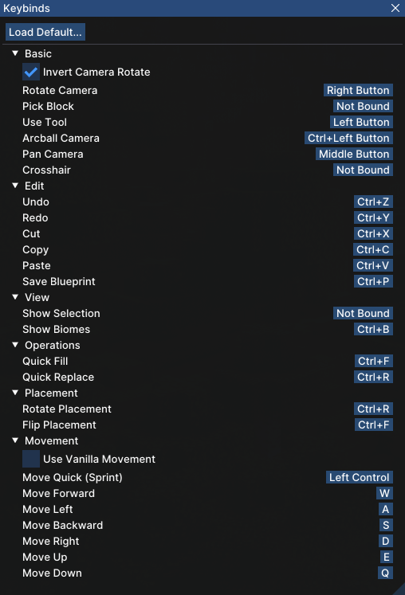

# axiom-two

QOL features added to [Axiom](https://axiom.moulberry.com/).

## Features

- When rotating your camera in Editor Mode, your mouse cursor will lock in the same place.
  - This type of movement is similar to Roblox Studio's. People familiar with Roblox Studio can have similar controls.
  - 
- More to come!

## Controls

If you want controls similar to Roblox Studio, use this configuration in Window > Keybinds.

## Building

1. Create a `libs` folder in the root directory.
2. Download the Axiom JAR file from [the website](https://axiom.moulberry.com/download) and place it in the `libs` folder.
3. Open the project in IntelliJ IDEA and run `gradle build`.
